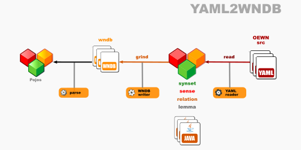
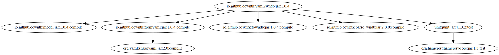

# Open English Wordnet YAML-to-WNDB grinder

This library reads from a model in YAML format and writes it to WNDB format.

Project [grind_yaml2wndb](https://github.com/oewntk/grind_yaml2wndb)

See also [model](https://github.com/oewntk/model/blob/master/README.md).

See also [fromyaml](https://github.com/oewntk/fromyaml/blob/master/README.md).

See also [towndb](https://github.com/x-englishwordnet/towndb/blob/master/README.md).

See also [x-englishwordnet](https://github.com/x-englishwordnet) and [globalwordnet/english-wordnet](https://github.com/globalwordnet/english-wordnet).

## Dataflow

This library reads from the OEWN distribution YAML files and other YAML files that contain extra data.

This output conforms to the **WNDB(5WN)** format (and is to be found in the _wndb_ directory).

## Command line

`grind.sh [YAML] [YAML2] [WNDB]`

grinds the WNDB database

`grind1.sh [YAML] [YAML2] [POS] [OFS]`

partially grinds the WNDB database and output line at *offset* of *data.{noun|verb|adj|adv}*

*where*

[YAML] directory where OEWN distribution YAML files are

[YAML2] directory where extra YAML files are

[WNDB] directory where WNDB files are output

[POS] n|v|a|r

[OFS] offset

## Maven Central

		<groupId>io.github.x-englishwordnet</groupId>
		<artifactId>yaml2wndb</artifactId>
		<version>1.0.0-SNAPSHOT</version>

## Dependencies

