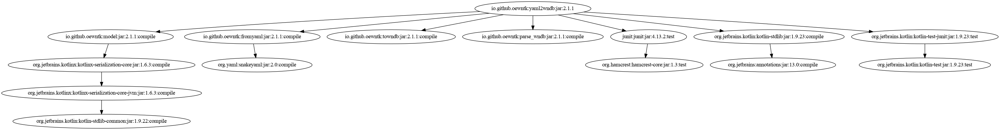

# Open English Wordnet YAML-to-WNDB grinder **[WORK IN PROGRESS]**

This library reads from a model in YAML format and writes it to WNDB format.

Project [grind_yaml2wndb](https://github.com/x-englishwordnet/grind_yaml2wndb)

See also [model](https://github.com/x-englishwordnet/model/blob/master/README.md).

See also [yaml](https://github.com/x-englishwordnet/yaml/blob/master/README.md).

See also [wndb](https://github.com/x-englishwordnet/wndb/blob/master/README.md).

See also [x-englishwordnet](https://github.com/x-englishwordnet) and [globalwordnet/english-wordnet](https://github.com/globalwordnet/english-wordnet).

This library reads from the OEWN distribution YAML files and other YAML files that contain extra data.

This output conforms to the **WNDB(5WN)** format (and is to be found in the _wndb_ directory).

## Command line

`grind.sh [YAML] [YAML2]`

grinds the WNDB database

`grind1.sh [YAML] [YAML2] [POS] [OFS]`

partially grinds the WNDB database and output line at *offset* of *data.{noun|verb|adj|adv}*

*where*

[YAML]    directory where OEWN distribution YAML files are

[YAML2]  directory where extra YAML files are

[POS]      n|v|a|r

[OFS]      offset

## Maven Central

		<groupId>io.github.x-englishwordnet</groupId>
		<artifactId>yaml2wndb</artifactId>
		<version>1.0.0-SNAPSHOT</version>

## Dependencies

